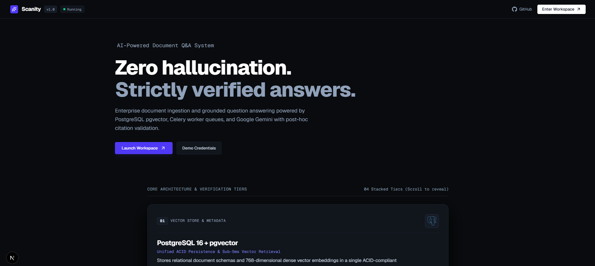
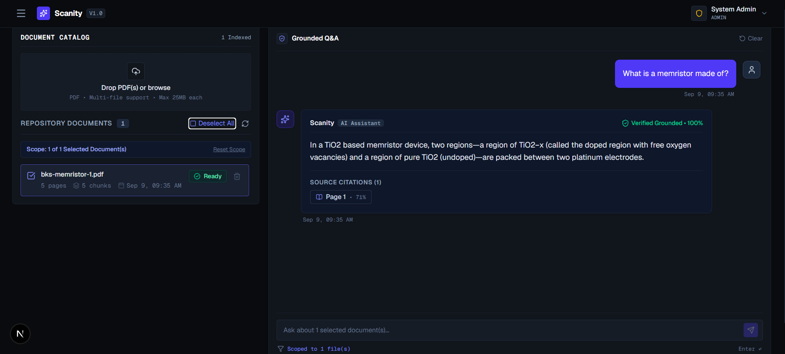

# Scanity: AI-Powered Document Q&A System

Scanity is an asynchronous, decoupled, enterprise-grade Retrieval-Augmented Generation (RAG) system engineered with FastAPI, PostgreSQL 16 (`pgvector`), Celery, Redis, Google Gemini, and Next.js 15.

Scanity allows organizations to ingest complex, multi-page PDF documents and query them in natural language, delivering factual answers strictly grounded in document text with page-level citations and anti-hallucination guardrails.

**Note:** The following is the [Github repo link](https://github.com/ConsoleCzar-2/Scanity).

---

## User Interface

### Landing Page


### Document Upload and Chat Interface


---

## 1. Key Architectural Highlights

- **Decoupled Asynchronous Ingestion (Celery + Redis):** Offloads CPU-intensive PDF parsing (PyMuPDF) and vector embedding generation to background Celery workers, preserving sub-20ms FastAPI response latency.
- **Unified Relational & Vector Store (PostgreSQL 16 + pgvector):** Relational document metadata and 768-dimensional normalized vector embeddings coexist in a single ACID database, ensuring atomic cascading deletes (`ON DELETE CASCADE`) with zero orphaned embeddings.
- **High-Performance HNSW Indexing:** Sub-5ms approximate nearest-neighbor retrieval via Hierarchical Navigable Small World graphs using `vector_cosine_ops`.
- **Monotonic Primary Keys (RFC 9562 UUIDv7):** Combines 48-bit millisecond timestamps with entropy to maintain sequential B-tree inserts and eliminate index fragmentation.
- **Anti-Hallucination Gate:** Rejects low-similarity queries (< 0.70 cosine similarity) before LLM synthesis, returning deterministic fallback responses without consuming generation tokens.
- **Dual-Layer Conversation History:** Instantaneous (0ms) client-side `localStorage` caching paired with durable PostgreSQL audit tables recording questions, answers, confidence scores, and citations keyed by session ID.
- **Dynamic Auto-Titling:** Conversation sessions automatically derive readable titles from the user's initial prompt in real time.
- **Modern Next.js 15 App Router:** Clean separation into a public landing page (with Skiper-style card stacking scroll), authentication (with demo accounts and registration), and an enterprise workspace with multi-file uploads and admin parameter sliders.

---

## 2. Quick Start Guide

### 2.1 Prerequisites
- Docker & Docker Compose
- Python 3.12+
- Node.js 18+ & npm

### 2.2 Infrastructure
```powershell
docker compose up -d db redis
```
> Note: Database port is mapped to host port `5433` (`5433:5432`) to prevent collisions with host PostgreSQL services.

### 2.3 Backend & Background Worker
```powershell
cd backend
.\venv\Scripts\activate
pip install -r requirements.txt
alembic upgrade head

# Terminal 1: API Server
uvicorn app.main:app --reload --host 0.0.0.0 --port 8000

# Terminal 2: Celery Worker (Windows native requires -P solo; WSL/Linux uses --concurrency=4)
celery -A app.workers.celery_app worker --loglevel=info -P solo
```

### 2.4 Frontend
```powershell
cd frontend
npm install
npm run dev
```

Application endpoints:
- **Landing Page**: `http://localhost:3000/`
- **Authentication**: `http://localhost:3000/login` (Admin and Customer demo credentials available)
- **Workspace**: `http://localhost:3000/chat` (Multi-file catalog, real-time scoping, session history, and Q&A)
- **Interactive API Docs**:
  - `http://localhost:8000/docs` (Swagger UI)
  - `http://localhost:8000/redoc` (ReDoc)

---

## 3. Verification & Testing

### 3.1 Automated Test Execution
- **Backend Test Suite (pytest):**
  ```powershell
  cd backend
  .\venv\Scripts\python.exe -m pytest -v
  ```
  Result: **7 passed in ~24s** (24 discrete unit and integration tests across ingestion, worker lifecycle, retrieval, and generation).

- **Frontend Quality & Build:**
  ```powershell
  cd frontend
  npm run lint
  npm run build
  ```
  Result: **0 errors, 0 warnings**, successfully compiled all static and dynamic App Router routes.

### 3.2 Live Verification Commands
```powershell
# Health probe
curl http://localhost:8000/api/v1/health

# Grounded Q&A query
curl -X POST "http://localhost:8000/api/v1/query" -H "Content-Type: application/json" -d '{\"question\": \"What is bit stuffing?\", \"top_k\": 3, \"threshold\": 0.70}'

# Query session history
curl "http://localhost:8000/api/v1/query/history?session_id=<your-session-id>"
```

---

## 4. Strategic Future Prospects

1. **Hybrid Sparse-Dense Retrieval (pgvector + BM25):**
   - Combining dense cosine semantic search with PostgreSQL `tsvector` keyword-based BM25 full-text indexing using Reciprocal Rank Fusion (RRF) to optimize retrieval for exact symbols, registers, and technical part numbers.
2. **Knowledge Graph & Multi-Hop Reasoning (GraphRAG):**
   - Entity-relation graph extraction from document chunks to enable multi-hop logical reasoning across disconnected sections, cross-document correlation, and complex dependency mapping across disparate chunks.
3. **Multimodal Document Understanding (Charts, Tables & Diagrams):**
   - Visual parsing of technical PDFs via multimodal vision models, converting schematics, architecture block diagrams, and complex financial tables into searchable semantic representations.
4. **Local Embedding Model (`intfloat/e5-large`):**
   - Self-hosted 1024-dimensional BERT-large dense vector model for on-premise execution, zero cloud API quotas, sub-30ms batch inference, and air-gapped data privacy.
5. **Server-Sent Events (SSE) Streaming:**
   - Real-time token delivery via FastAPI `StreamingResponse` over an HTTP SSE connection, replacing artificial client typewriter pacing with true token streaming.
6. **Multi-Tenant Workspaces & Role-Based Access Control (RBAC):**
   - Enterprise organization workspaces, project-level document isolation, encrypted API keys, and granular document-level access control lists (ACLs).

---

## 5. Documentation Index

Detailed technical design documents in the `docs/` directory:

| Document | Description |
|---|---|
| [System Architecture](docs/ARCHITECTURE.md) | Decoupled tiers, modular backend structure, RAG pipeline, and architectural trade-offs. |
| [Ingestion & Workers](docs/INGESTION_AND_WORKERS.md) | PyMuPDF parsing, ~700-token chunking with overlap, L2 normalization, and Celery + Redis worker architecture. |
| [Database & Schema](docs/DATABASE.md) | PostgreSQL + pgvector setup, UUIDv7 primary keys, ERD, tables catalog, and HNSW indexes. |
| [API Reference](docs/API.md) | Complete documentation of all live REST endpoints, query history APIs, request/response schemas, and curl examples. |
| [Testing Strategy & Results](docs/TESTING.md) | Complete test catalogs, synthetic PDF generation, full unit test execution logs, and frontend verification. |
| [Frontend Architecture](docs/FRONTEND.md) | Next.js 15 App Router specifications, component hierarchy, session storage, and citation chip UI design. |
| [Deployment & Operations](docs/DEPLOYMENT.md) | Container topology, port allocations, persistent volumes, environment configs, and health probes. |
| [UML & Sequence Diagrams](docs/UML.md) | Domain class diagrams, ingestion sequence, query validation, and session management workflows. |
