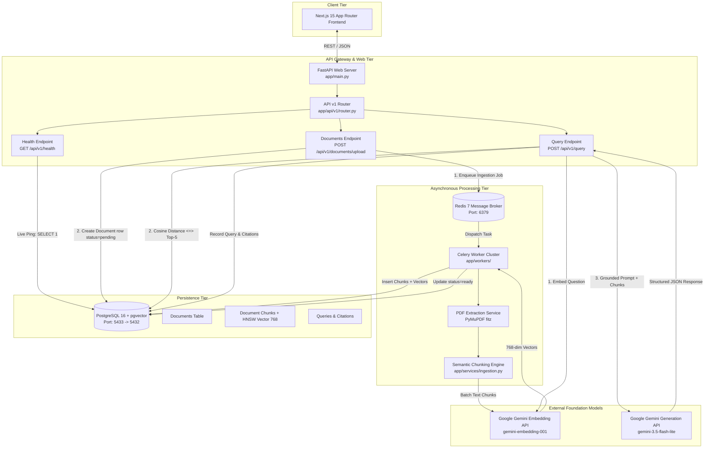

# System Architecture

Scanity is engineered as a decoupled, asynchronous, enterprise-grade RAG (Retrieval-Augmented Generation) system. Its architecture ensures that CPU-intensive document extraction, chunking, and embedding operations never degrade API responsiveness or block concurrent users.

---

## 1. High-Level Architecture Diagram



---

## 2. Modular Backend Architecture

The backend adheres to a clean, decoupled domain package layout:

```
backend/
├── alembic.ini                   # Alembic migration runner configuration
├── requirements.txt              # Pinned application dependencies
├── alembic/                      # Database migration scripts
│   ├── env.py                    # Async connection runner & metadata binding
│   ├── script.py.mako            # Migration template
│   └── versions/                 # Versioned migration files
└── app/
    ├── __init__.py
    ├── main.py                   # FastAPI initialization, CORS, middleware, router mount
    ├── core/                     # Core infrastructure & configuration
    │   ├── __init__.py
    │   ├── config.py             # Settings loader with smart port fallback
    │   └── database.py           # Async engine, sessionmaker, and get_db dependency
    ├── models/                   # SQLAlchemy 2.0 ORM domain models
    │   ├── __init__.py           # Unified exports for Alembic
    │   ├── base.py               # DeclarativeBase with UUIDv7 generator
    │   ├── document.py           # Document & DocumentChunk with pgvector
    │   └── query.py              # Query, QueryCitation, QueryDocument
    ├── schemas/                  # Pydantic validation schemas (scaffolded)
    │   └── __init__.py
    ├── api/                      # REST API routing
    │   ├── __init__.py
    │   ├── deps.py               # Shared endpoint dependencies
    │   └── v1/
    │       ├── __init__.py
    │       ├── router.py         # Consolidated v1 router
    │       └── endpoints/
    │           ├── __init__.py
    │           └── health.py     # Live DB probe endpoint
    ├── services/                 # Pure business logic (scaffolded)
    │   └── __init__.py           # ingestion, retrieval, generation
    └── workers/                  # Background worker definitions (scaffolded)
        └── __init__.py           # Celery application and task definitions
```

---

## 3. Core Architectural Decisions & Trade-Offs

### 3.1 Celery + Redis vs. FastAPI BackgroundTasks
* **Decision:** Celery with Redis as the message broker.
* **Rationale:** FastAPI's built-in `BackgroundTasks` runs inside the same Python process as the web server. For lightweight tasks (like sending a verification email), this is acceptable. However, PDF parsing with PyMuPDF, chunking text, and waiting on external embedding API calls is CPU and network intensive. Running this in the web server process degrades concurrency and risks catastrophic task loss if the server restarts. Celery provides persistent message queues, worker auto-scaling, automatic task retries with exponential backoff, and distributed execution.

### 3.2 PostgreSQL + `pgvector` vs. Dedicated Vector Database (e.g., Pinecone/Qdrant)
* **Decision:** PostgreSQL 16 with the native `pgvector` extension.
* **Rationale:**
  1. **Transactional Integrity (ACID):** Deleting a document atomically deletes all its chunks and vector embeddings via PostgreSQL's `ON DELETE CASCADE`. In a multi-database architecture (e.g., Postgres + Pinecone), network timeouts or partial failures create "ghost embeddings" in the vector store that cite deleted documents.
  2. **Joint Relational & Vector Filtering:** Queries scoped to specific document IDs (`WHERE document_id IN (...)`) allow PostgreSQL's query optimizer to evaluate relational filters alongside the HNSW vector index in a single execution plan.
  3. **Operational Simplicity:** Unified backups (`pg_dump`), point-in-time recovery, user auth, and vector similarity in one single container with zero additional operational overhead.

### 3.3 UUIDv7 vs. Standard UUIDv4
* **Decision:** Standardize all table primary keys on UUIDv7 (RFC 9562).
* **Rationale:** Standard UUIDv4 values are completely random, scattering row inserts unpredictably across disk pages. In tables with thousands of document chunks, this causes massive **B-tree index fragmentation** and frequent page splits. UUIDv7 prefixes a 48-bit millisecond Unix timestamp to cryptographically random bytes, guaranteeing that records are **monotonically increasing**. This combines the sequential insertion speed of auto-incrementing integers (`BIGSERIAL`) with the security and uniqueness of UUIDs.

---

## 4. Grounded RAG Pipeline Design

### 4.1 Ingestion Pipeline
*(See [Document Ingestion & Workers](INGESTION_AND_WORKERS.md) for complete algorithmic details and benchmarks.)*

1. **Upload & Staging:** PDF received via `POST /api/v1/documents/upload`. Stored on disk (`/uploads`) and recorded in `documents` with status `pending`.
2. **Asynchronous Dispatch:** An ingestion task is enqueued to Redis via `process_pdf_task.delay(document_id, file_path)`.
3. **Extraction & Chunking:** PyMuPDF extracts text per page. The text is chunked to ~700 tokens with 100-token overlap, preserving `page_number` and `chunk_index`.
4. **Vector Embedding:** Chunks are sent in batches to Google Gemini (`gemini-embedding-001`), producing 768-dimensional vectors.
5. **Persistence & Indexing:** Chunks and embeddings are stored in `document_chunks`. The HNSW index enables sub-10ms nearest-neighbor retrieval. Status updates to `ready`.

### 4.2 Query & Guardrail Pipeline
1. **Question Embedding:** User question is embedded into a 768-dimensional vector using the exact same Gemini model.
2. **Vector Similarity Search:** PostgreSQL executes a cosine distance query (`<=>`) to retrieve the top 5 chunks.
3. **Relevance Threshold Gate:** If the cosine similarity of the top chunk is below `0.70`, the pipeline halts immediately and returns *"Not found in the provided document(s)"* without invoking the LLM.
4. **Constrained Prompting:** The LLM is instructed to answer strictly from the retrieved chunks.
5. **Post-Hoc Citation Verification:** The system verifies that every cited chunk ID in the model's output corresponds to a chunk genuinely retrieved from the database.
