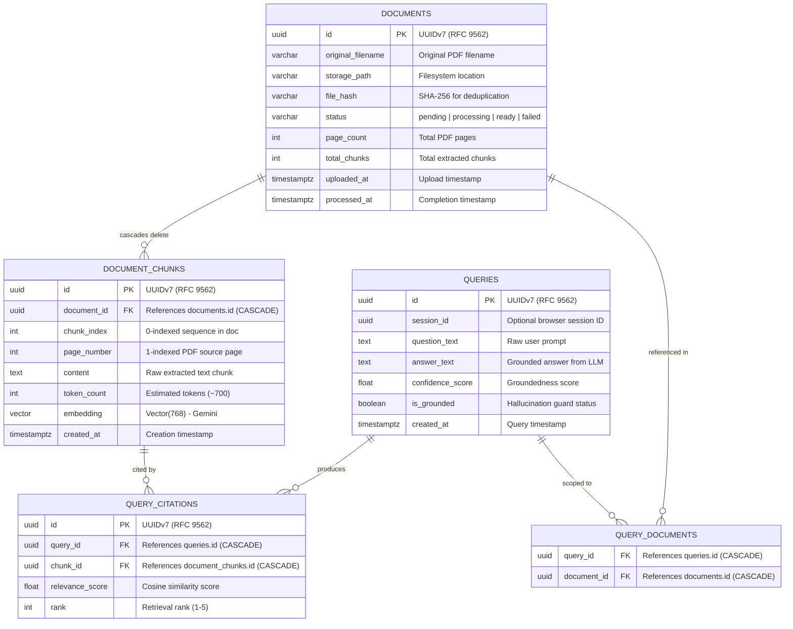

# Database & Schema Documentation

Scanity uses **PostgreSQL 16** with the **`pgvector`** extension (version 0.8.6) as a unified store for relational entities, application metadata, and high-dimensional vector embeddings.

---

## 1. Entity Relationship Diagram (ERD)



---

## 2. Table Catalog

### 2.1 `documents`
Stores metadata and lifecycle tracking for uploaded PDF documents.

| Column | Type | Nullable | Description |
|---|---|---|---|
| `id` | `UUID` | No | UUIDv7 primary key (indexed) |
| `original_filename` | `VARCHAR(255)` | No | User's original uploaded filename (e.g., `financial_report.pdf`) |
| `storage_path` | `VARCHAR(500)` | No | Internal storage URI: `uploads/{doc_id}.pdf` (local) or `gs://{bucket}/documents/{doc_id}.pdf` (GCP) |
| `file_hash` | `VARCHAR(64)` | Yes | SHA-256 hex digest for duplicate upload detection (indexed) |
| `status` | `VARCHAR(50)` | No | Ingestion lifecycle state: `pending`, `processing`, `ready`, `failed` (indexed) |
| `page_count` | `INTEGER` | Yes | Total pages extracted by PyMuPDF |
| `total_chunks` | `INTEGER` | Yes | Total chunks generated |
| `uploaded_at` | `TIMESTAMPTZ` | No | UTC timestamp when document was uploaded |
| `processed_at` | `TIMESTAMPTZ` | Yes | UTC timestamp when ingestion finished |

#### Document Ingestion State Machine:
* **`pending`:** File is saved to storage; Celery task has been queued to Redis.
* **`processing`:** Background Celery worker has dequeued the task and is actively parsing pages, chunking text, or generating Gemini embeddings.
* **`ready`:** Document chunks and 768-dimensional embeddings are persisted in PostgreSQL; HNSW index is updated and available for queries.
* **`failed`:** Parsing or processing failed; error details logged and document flagged to avoid infinite polling.

### 2.2 `document_chunks`
Stores text segments and high-dimensional vector embeddings extracted from documents.

| Column | Type | Nullable | Description |
|---|---|---|---|
| `id` | `UUID` | No | UUIDv7 primary key (indexed) |
| `document_id` | `UUID` | No | Foreign key referencing `documents(id)` with `ON DELETE CASCADE` |
| `chunk_index` | `INTEGER` | No | Zero-based sequence order within the document |
| `page_number` | `INTEGER` | No | 1-based PDF page number for citation tracking |
| `content` | `TEXT` | No | Raw text of the ~700 token chunk |
| `token_count` | `INTEGER` | Yes | Token length of the chunk |
| `embedding` | `VECTOR(768)` | Yes | 768-dimensional vector embedding |
| `created_at` | `TIMESTAMPTZ` | No | UTC creation timestamp |

**Indexes on `document_chunks`:**
* `document_chunks_pkey`: Primary key B-tree on `(id)`.
* `ix_document_chunks_document_id`: B-tree on `(document_id)` for high-speed cascading lookups.
* `ix_document_chunks_embedding`: **HNSW index** using `vector_cosine_ops` for approximate nearest-neighbor vector search.

### 2.3 `queries`
Stores natural-language questions asked by users and the generated responses.

| Column | Type | Nullable | Description |
|---|---|---|---|
| `id` | `UUID` | No | UUIDv7 primary key (indexed) |
| `session_id` | `UUID` | Yes | Optional browser session identifier (indexed) |
| `question_text` | `TEXT` | No | User's question |
| `answer_text` | `TEXT` | Yes | Grounded answer from the model (or fallback string) |
| `confidence_score` | `FLOAT` | Yes | Groundedness score (0.0 to 1.0) |
| `is_grounded` | `BOOLEAN` | No | Flag indicating if response met threshold criteria |
| `created_at` | `TIMESTAMPTZ` | No | UTC query timestamp |

### 2.4 `query_documents`
Association table linking queries to the set of documents they were scoped to.

| Column | Type | Nullable | Description |
|---|---|---|---|
| `query_id` | `UUID` | No | Foreign key referencing `queries(id)` with `ON DELETE CASCADE` |
| `document_id` | `UUID` | No | Foreign key referencing `documents(id)` with `ON DELETE CASCADE` |

### 2.5 `query_citations`
Records the exact document chunks cited in a query response, with similarity scores and ranking.

| Column | Type | Nullable | Description |
|---|---|---|---|
| `id` | `UUID` | No | UUIDv7 primary key (indexed) |
| `query_id` | `UUID` | No | Foreign key referencing `queries(id)` with `ON DELETE CASCADE` (indexed) |
| `chunk_id` | `UUID` | No | Foreign key referencing `document_chunks(id)` with `ON DELETE CASCADE` (indexed) |
| `relevance_score` | `FLOAT` | Yes | Cosine similarity value (`1.0 - cosine_distance`) |
| `rank` | `INTEGER` | Yes | Ordering rank (1 through 5) |

---

## 3. Vector Indexing: HNSW vs. IVFFlat

Scanity uses an **HNSW (Hierarchical Navigable Small World)** index on `document_chunks.embedding`:
```sql
CREATE INDEX IF NOT EXISTS ix_document_chunks_embedding 
ON document_chunks 
USING hnsw (embedding vector_cosine_ops);
```

### Why HNSW?
1. **Works with Empty/Small Tables:** Unlike `IVFFlat` (which requires hundreds of pre-existing rows to compute k-means centroids during index creation), HNSW builds graphs incrementally from the very first row.
2. **Superior Recall/Latency Trade-off:** HNSW delivers higher retrieval recall (>98%) with lower query latency (sub-5ms) compared to IVFFlat.
3. **Cosine Distance Operator:** Uses `<=>`, which calculates cosine distance between two vectors:
   $$\text{cosine distance} = 1 - \frac{A \cdot B}{\|A\| \|B\|}$$

---

## 4. UUIDv7 Primary Key Strategy

All models use **UUIDv7 (RFC 9562)** generated via the `uuid6` package (`from uuid6 import uuid7`).
* **Format:** 48 bits of millisecond timestamp + 12 bits of version/counter + 62 bits of random entropy.
* **Benefit:** When inserting thousands of document chunks, records are monotonically increasing. This prevents random B-tree page splits, maintains high index fill factors, and reduces disk I/O.

---

## 5. Alembic Migrations

Schema migrations are managed with Alembic configured for asynchronous execution:
* **Configuration:** `backend/alembic.ini` and `backend/alembic/env.py`.
* **Dynamic Connection:** `env.py` dynamically sources `DATABASE_URL` from application settings, ensuring credentials are never hardcoded.
* **Applied Migrations:**
  - `41f1ccc1abd5_initial_schema_with_pgvector_and_uuid7.py`: Enables `vector` extension and creates all 5 tables plus the HNSW vector index.

### Common Migration Commands
```powershell
cd backend
.\venv\Scripts\activate

# Apply migrations
alembic upgrade head

# Roll back the last migration
alembic downgrade -1

# View migration history
alembic history --verbose
```

---

## 6. Host Port Configuration Note

In local development, the Docker PostgreSQL container maps port **`5433`** to the internal container port **`5432`** (`5433:5432`). This intentional design prevents port collisions with native Windows PostgreSQL services running on port `5432`. Application configuration in `app/core/config.py` automatically routes requests targeting `localhost:5432` to port `5433`.

---

## 7. Vector Schema Evolution: Migrating to 1024-D for `intfloat/e5-large`

When transitioning from cloud `gemini-embedding-001` (768-D) to the self-hosted local model `intfloat/e5-large` (1024-D), the database schema evolves via an Alembic migration:

### 7.1 Schema Modification
```sql
-- 1. Alter vector dimension
ALTER TABLE document_chunks 
ALTER COLUMN embedding TYPE vector(1024);

-- 2. Drop existing index and rebuild with new dimensions
DROP INDEX IF EXISTS ix_document_chunks_embedding;

CREATE INDEX ix_document_chunks_embedding 
ON document_chunks 
USING hnsw (embedding vector_cosine_ops);
```

### 7.2 Alembic Migration Implementation
```python
def upgrade() -> None:
    op.alter_column(
        "document_chunks",
        "embedding",
        type_=Vector(1024),
        existing_type=Vector(768),
    )
    op.execute("DROP INDEX IF EXISTS ix_document_chunks_embedding;")
    op.execute(
        "CREATE INDEX ix_document_chunks_embedding ON document_chunks "
        "USING hnsw (embedding vector_cosine_ops);"
    )

def downgrade() -> None:
    op.alter_column(
        "document_chunks",
        "embedding",
        type_=Vector(768),
        existing_type=Vector(1024),
    )
    op.execute("DROP INDEX IF EXISTS ix_document_chunks_embedding;")
    op.execute(
        "CREATE INDEX ix_document_chunks_embedding ON document_chunks "
        "USING hnsw (embedding vector_cosine_ops);"
    )
```

### 7.3 Operational Considerations
* **Index Size:** Vector dimensions increase by 33.3% (from 768 to 1024 floats per chunk). In PostgreSQL `pgvector`, 100,000 chunks require ~410MB for raw vectors and ~550MB for the HNSW graph index, remaining well within standard database memory bounds.
* **Re-embedding Requirement:** Because vectors from different embedding spaces are non-comparable, existing documents must be re-embedded when switching the underlying model.

