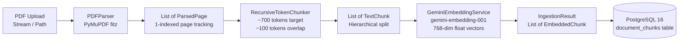
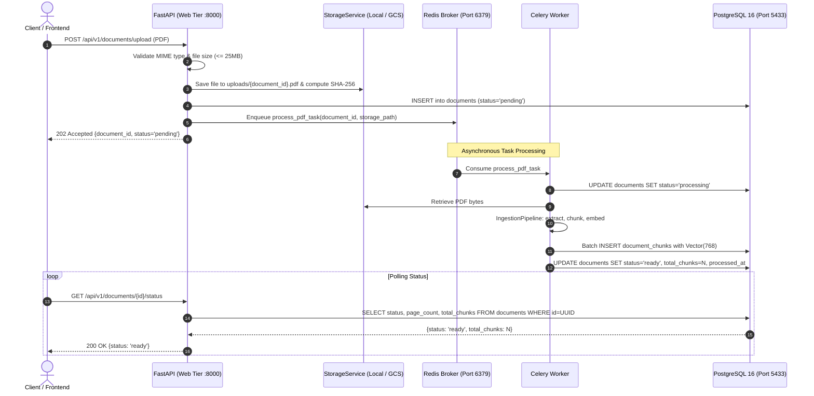

# Document Ingestion & Background Workers

This document details the Scanity document ingestion pipeline and asynchronous task worker architecture.

---

## 1. Overview & Decoupled Design

Processing high-volume or complex multi-page PDFs is CPU- and I/O-intensive. To prevent blocking the FastAPI web server, document processing is decoupled into a standalone ingestion service (`backend/app/services/ingestion.py`) that can be executed synchronously in CLI/test environments or asynchronously via Celery worker pools (`backend/app/workers/`).



---

## 2. Ingestion Pipeline Components (`app/services/ingestion.py`)

### 2.1 PDF Parsing (`PDFParser`)
* **Engine:** PyMuPDF (`pymupdf` v1.28.2).
* **Supported Inputs:** Filesystem path (`str`, `Path`) or in-memory byte buffer (`bytes`).
* **Text Normalization (`clean_text`):**
  * Replaces Windows/Unix CRLF (`\r\n`) with LF (`\n`).
  * Collapses horizontal whitespace (multiple spaces and tabs) into single spaces.
  * Collapses 3+ consecutive newlines into 2, maintaining paragraph separation without vertical sprawl.
* **Page Tracking:**
  * Preserves exact 1-indexed `page_number` for each extracted page.
  * Skips empty or unextractable pages with debug logging.

### 2.2 Recursive Semantic Chunker (`RecursiveTokenChunker`)
* **Target Size:** ~700 tokens (~2,800 characters, using 4 chars/token heuristic).
* **Sliding Overlap:** ~100 tokens (~400 characters).
* **Splitting Hierarchy:**
  Recursively traverses natural grammatical separators in descending order of semantic significance:
  1. `\n\n` (Paragraph breaks)
  2. `\n` (Line breaks)
  3. `. `, `? `, `! ` (Sentence terminators)
  4. `; `, `, ` (Clause separators)
  5. ` ` (Word whitespace)
  6. Character slicing (emergency boundary fallback)
* **Overlap Window Mechanics:**
  When transitioning between adjacent chunks on the same page, the trailing ~400 characters (~100 tokens) of the prior chunk are prepended to the subsequent chunk. This guarantees that conditional statements, premise-conclusion structures, and cross-sentence concepts are not severed.
* **Chunk Traceability:**
  Every `TextChunk` records:
  * `chunk_index`: Globally sequential zero-indexed identifier across the document.
  * `page_number`: Exact source PDF page number for citation generation.
  * `token_count`: Estimated token count.

### 2.3 Gemini Embedding Service (`GeminiEmbeddingService`)
* **Model:** `gemini-embedding-001` (configured via `settings.EMBEDDING_MODEL`).
* **Dimension:** Fixed **768** float values per vector (`VECTOR_DIMENSION`), matching the PostgreSQL `Vector(768)` column.
* **Batching:** Groups text chunks into batches of up to 50 items per API request to respect payload limits and optimize network round-trips.
* **Deterministic Mock Fallback:**
  If `GEMINI_API_KEY` is not provided or set to a placeholder, the service generates deterministic, Euclidean unit-normalized 768-dimensional float vectors derived from the SHA-256 hash of the chunk content:
  $$\|v\|_2 = \sqrt{\sum v_i^2} \approx 1.0$$
  This allows testing extraction, chunking, database persistence, and cosine distance queries (`<=>`) completely offline without requiring paid API quota.

### 2.4 Pipeline Facade (`IngestionPipeline`)
Coordinates the entire lifecycle:
```python
from app.services.ingestion import IngestionPipeline

pipeline = IngestionPipeline()
result = pipeline.process_pdf("path/to/document.pdf", filename="report.pdf")

print(f"Extracted {result.page_count} pages.")
print(f"Generated {result.total_chunks} embedded chunks.")
```

---

## 3. Data Transfer Schemas (`app/schemas/document.py`)

| Schema | Fields | Description |
|---|---|---|
| `ParsedPage` | `page_number: int`<br/>`text: str`<br/>`char_count: int` | Sanitized text from a single PDF page |
| `TextChunk` | `chunk_index: int`<br/>`page_number: int`<br/>`content: str`<br/>`token_count: int` | Sliced text segment with sequence and page tracking |
| `EmbeddedChunk` | `chunk_index: int`<br/>`page_number: int`<br/>`content: str`<br/>`token_count: int`<br/>`embedding: List[float]` | Chunk paired with 768-dimensional float embedding |
| `IngestionResult` | `filename: str`<br/>`page_count: int`<br/>`total_chunks: int`<br/>`chunks: List[EmbeddedChunk]` | Complete pipeline output payload |
| `DocumentResponse` | `id: UUID`<br/>`original_filename: str`<br/>`status: str`<br/>`page_count: Optional[int]`<br/>`total_chunks: Optional[int]` | Document status response schema |

---

## 4. Background Workers (Celery + Redis Architecture)

*(Fully Implemented & Verified in Step 5)*

Scanity processes high-volume PDF parsing and vector embeddings asynchronously via Celery and Redis to prevent blocking the FastAPI web server.



### 4.1 Worker Architecture Highlights
* **Message Broker & Backend:** Redis 7 Alpine running in Docker (`scanity_redis`) on port `6379`.
* **Pluggable Storage Service:** Operates on local storage (`./uploads/{doc_id}.pdf`) with pluggable Google Cloud Storage (`gs://...`) abstraction for future GCP deployment.
* **Task Serialization:** Uses JSON serialization, UTC timekeeping, and task tracking (`task_track_started=True`).
* **Task Retries & Error Boundaries:** If an unrecoverable parsing error occurs, the worker sets `status='failed'` in PostgreSQL so clients polling the status see an accurate failure state instead of hanging.

### 4.2 How to Run Celery Workers

#### On Windows Native (PowerShell):
Because Windows does not support POSIX `fork()`, Celery must be started with the `-P solo` pool flag:
```powershell
cd backend
.\venv\Scripts\activate
celery -A app.workers.celery_app worker --loglevel=info -P solo
```

#### In WSL (Windows Subsystem for Linux):
WSL2 supports native Linux multi-processing:
```bash
cd /mnt/c/Users/ABHIRUP/Documents/GitHub/Scanity/backend
source venv/bin/activate
celery -A app.workers.celery_app worker --loglevel=info --concurrency=4
```
*(WSL2 shares localhost ports with Windows, automatically connecting to Redis on port 6379 and PostgreSQL on port 5433).*
