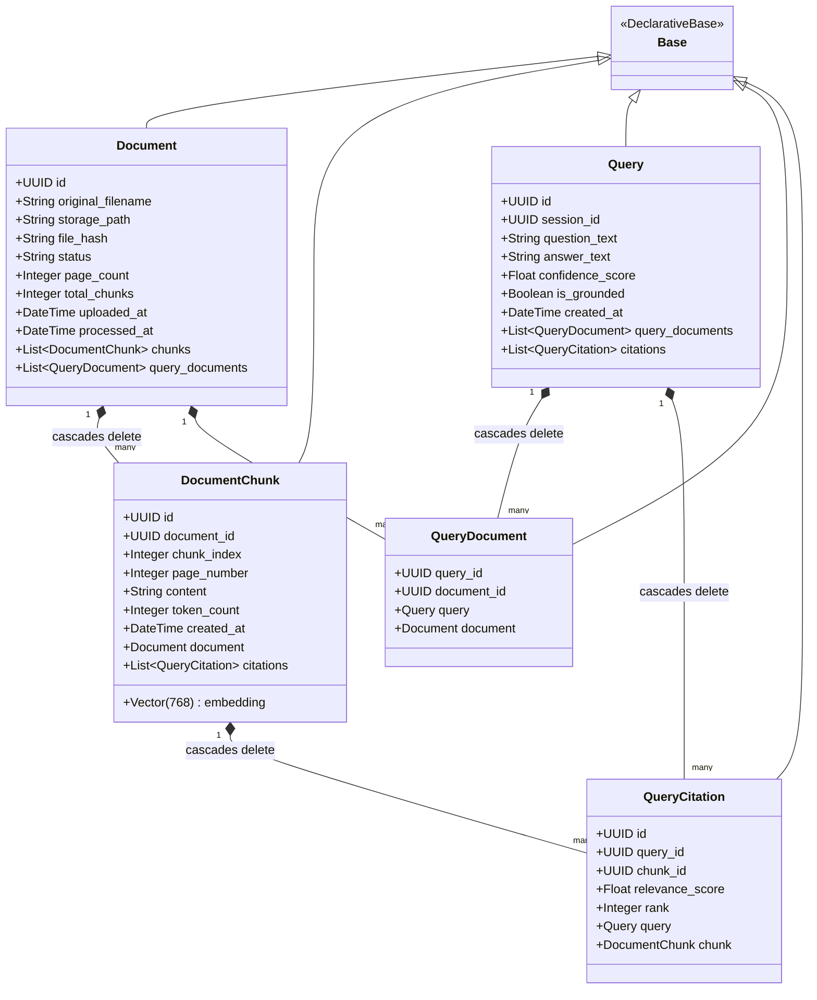
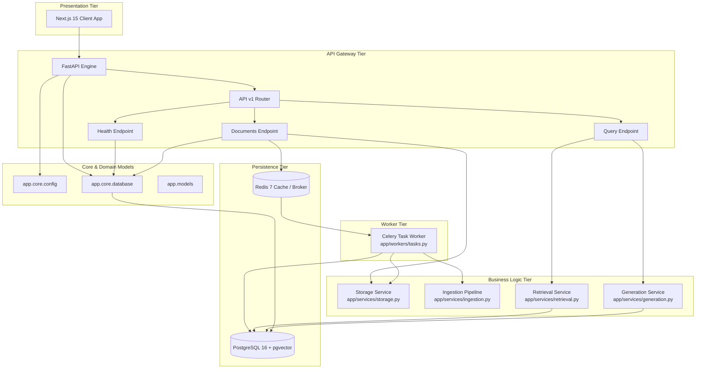
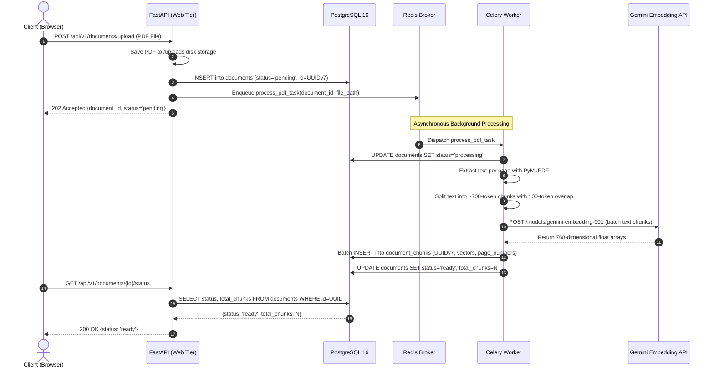
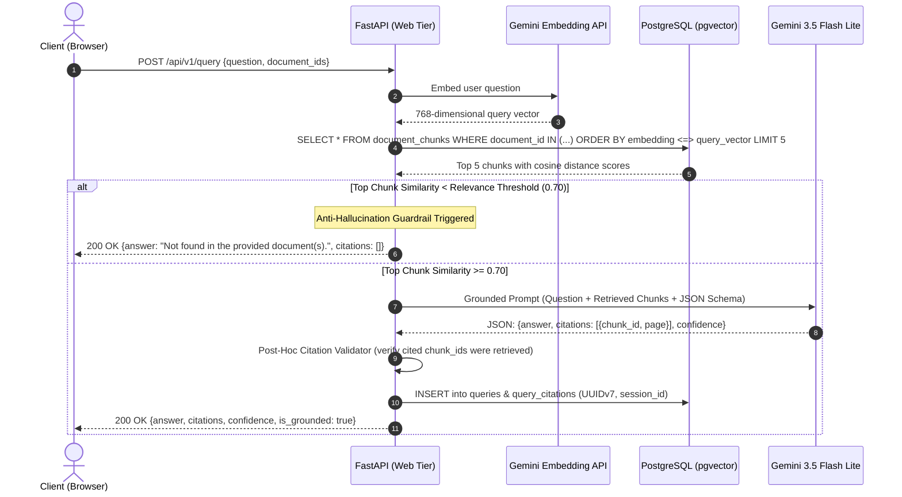
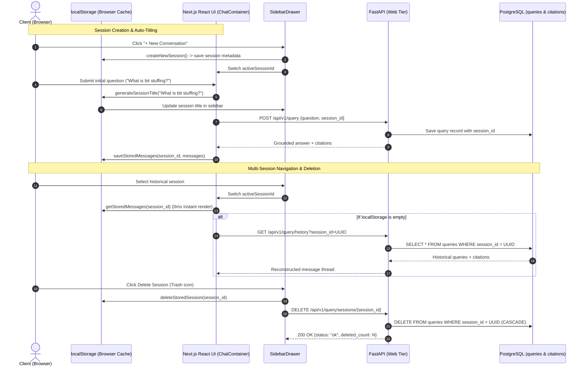

# UML & System Diagrams

This document provides formal UML diagrams illustrating Scanity's object models, component dependencies, and runtime sequences.

---

## 1. Domain Class Diagram (SQLAlchemy Models)

---

## 2. Component Diagram

---

## 3. Runtime Sequence Diagrams

### 3.1 Document Upload & Ingestion Flow
Demonstrates the asynchronous decoupling of PDF parsing and embedding generation using Celery and Redis.

---

### 3.2 Grounded Retrieval & Answer Generation Flow
Illustrates vector similarity ranking, the relevance threshold gate, structured output generation, and post-hoc citation validation.

---

### 3.3 Session Lifecycle & Conversation History Flow
Illustrates client-side dual-layer storage synchronization, prompt-based auto-titling, and backend audit retrieval and deletion.

